  

 

## 🚀 Proyectos

> 👉 Toca una tarjeta para abrir el repo. Debajo, los proyectos que se despliegan.

<table>
<tr>
<td width="50%" valign="top">

### 🛡️ [sgsi-novaretail](https://github.com/savkacarvajal/sgsi-novaretail)
SGSI basado en ISO/IEC 27001:2022.

</td>
<td width="50%" valign="top">

### 📱 [HomePass](https://github.com/savkacarvajal/HomePass)
App Android con Kotlin.

</td>
</tr>
<tr>
<td width="50%" valign="top">

### 🏠 [miksapropiedades](https://github.com/savkacarvajal/miksapropiedades)
Sitio web inmobiliario.

</td>
<td width="50%" valign="top">

### 🚚 [Gmexpress-Backend](https://github.com/savkacarvajal/Gmexpress-Backend)
Backend del proyecto Gm Express.

</td>
</tr>
</table>

<b>☁️ AWS Gallery</b> · galería de fotos en la nube

 

Despliegue de una galería de fotos en AWS, con informe técnico de la arquitectura.

<b>🛡️ SGSI · ISO/IEC 27001:2022</b> · gestión de seguridad de la información

 

Diseño de un SGSI basado en ISO/IEC 27001:2022 para un caso de retail.
→ [Ver el repo](https://github.com/savkacarvajal/sgsi-novaretail)

<b>🌐 Laboratorios de redes</b> · Cisco Packet Tracer y GNS3

 

OSPF, VLAN, DHCP y segmentación de una red corporativa, con informe y defensa oral.

<b>💡 uLamp / Ambilight</b> · ingeniería inversa BLE

 

Ingeniería inversa del protocolo Bluetooth LE de una tira LED WS2812.

<b>🤖 Bots de Telegram</b> · control remoto

 

Control de máquinas Windows a distancia mediante Telegram, en Python.

<b>🐧 Mi entorno Linux</b> · CachyOS + Hyprland

 

Escritorio a medida: barra Waybar, dashboard con EWW, paneles con Quickshell, visualizador de audio, panel de Wi-Fi/Bluetooth y pantalla de bloqueo propia. Paleta azul, por supuesto. Los dotfiles viven en un repo privado.

## 🌙 Sobre mí

<b>Toca para plegar o desplegar</b>

 

| | |
|---|---|
| 🎓 **Estudio** | Redes, cloud y ciberseguridad |
| 🔭 **Ahora estoy en** | Hardening, ISO 27001 y laboratorios de red |
| 🛠️ **Me gusta hacer** | Apps Android, sitios web y automatizaciones |
| 🐧 **Mi sistema** | CachyOS + Hyprland, todo personalizado |
| 💙 **Mi color** | Azul. Siempre azul |

## 🛠️ Stack

<b>Toca para plegar o desplegar</b>

 

**Redes y seguridad**

**Cloud**

**Desarrollo**

**Herramientas**

## 🐍 Actividad

  

<picture>
  <source media="(prefers-color-scheme: dark)" srcset="https://raw.githubusercontent.com/savkacarvajal/savkacarvajal/output/github-snake-dark.svg" />
  <source media="(prefers-color-scheme: light)" srcset="https://raw.githubusercontent.com/savkacarvajal/savkacarvajal/output/github-snake.svg" />
  
</picture>

  

  

